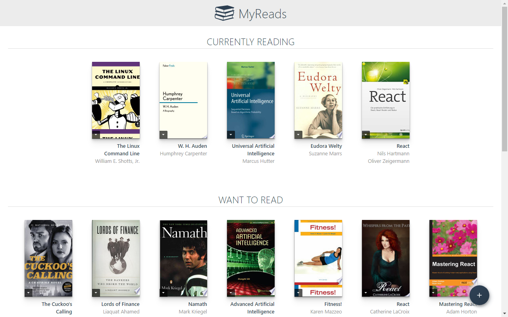
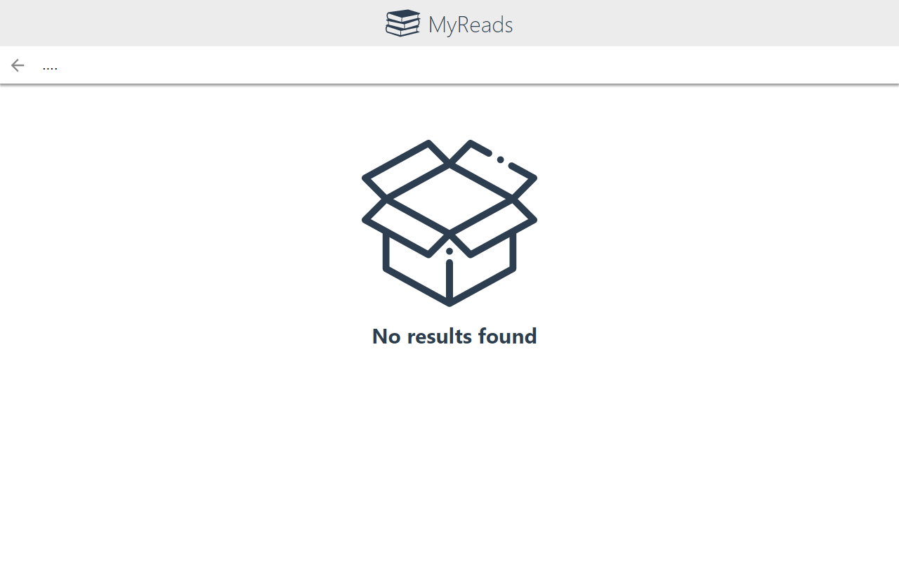
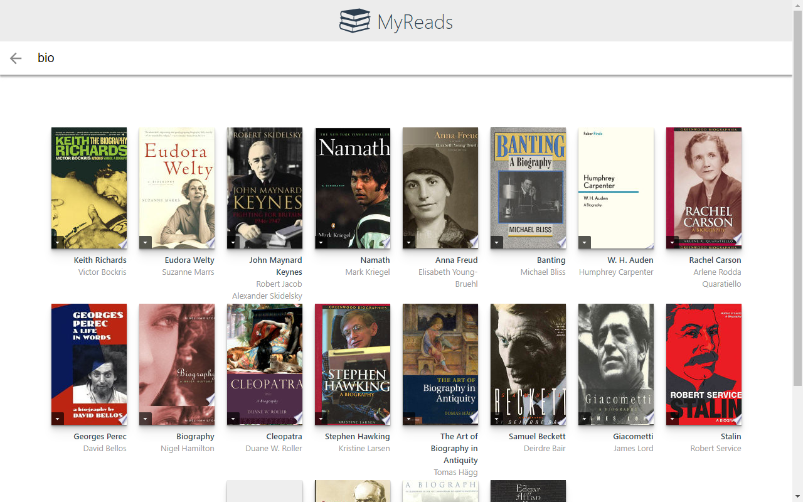

# MyReads: A Book Lending App

 A bookshelf app that allows you to select and categorize books you have read, are currently reading, or want to read. The project emphasizes using React to build the application and provides an API server and client library that you will use to persist information as you interact with the application.

## Preview

<span>



 <span>

## Getting Started

To get started developing right away:

* install all project dependencies with `npm install`
* start the development server with `npm start`

## What You're Getting
```bash
├── CONTRIBUTING.md
├── README.md - This file.
├── SEARCH_TERMS.md
├── doc
│   └── images
│       ├── home-screen.png
│       ├── no-result.png
│       └── results.png
├── package.json
├── public
│   ├── favicon.ico
│   └── index.html
└── src
    ├── App.css
    ├── App.js
    ├── App.test.js
    ├── BooksAPI.js
    ├── icons
    │   ├── add.svg
    │   ├── arrow-back.svg
    │   ├── books.svg
    │   ├── box.svg
    │   └── arrow-drop-down.svg
    ├── index.css
    ├── index.js
    └── components
        ├── Book.js
        ├── BookShelf.js
        └── SearchField.js
```
NB: `books.svg` and `box.svg` are gotten from [flaticon.com](https://www.flaticon.com)

Remember that good React design practice is to create new JS files for each component and use import/require statements to include them where they are needed.

## Backend Server Methods

* [`getAll`](#getall)
* [`update`](#update)
* [`search`](#search)

### `getAll`

Method Signature:

```js
getAll()
```

* Returns a Promise which resolves to a JSON object containing a collection of book objects.
* This collection represents the books currently in the bookshelves in your app.

### `update`

Method Signature:

```js
update(id, shelf)
```

* id: `<String>` containing an `id`
* shelf: `<String>` contains one of ["wantToRead", "currentlyReading", "read"]
* Returns a Promise which resolves to a JSON object containing the response data of the POST request

### `search`

Method Signature:

```js
search(query)
```

* query: `<String>`
* Returns a Promise which resolves to a JSON object containing a collection of a maximum of 20 book objects.
* These books do not know which shelf they are on. They are raw results only. You'll need to make sure that books have the correct state while on the search page.

## Important
The backend API uses a fixed set of cached search results and is limited to a particular set of search terms, which can be found in [SEARCH_TERMS.md](SEARCH_TERMS.md). That list of terms are the _only_ terms that will work with the backend, so don't be surprised if your searches for Basket Weaving or Bubble Wrap don't come back with any results.

## Create React App

This project was bootstrapped with [Create React App](https://github.com/facebookincubator/create-react-app). You can find more information on how to perform common tasks [here](https://github.com/facebookincubator/create-react-app/blob/master/packages/react-scripts/template/README.md).
